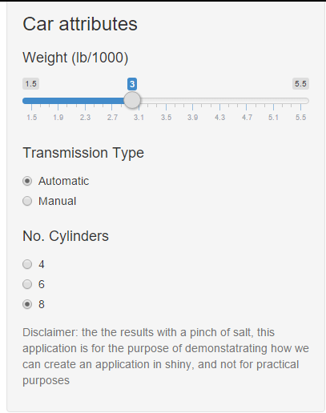

## Motivation

Often time, it is difficult to estimate the performance of a car, This app is written to provide an estimate of the performance in terms of fuel efficiency, engine power, quarter mile time and size from the weight of the vehicle, number of cylinders, and transmission type 
This app provides a simple user interface where users may adjust the weight and the chracteristic of the car, and visually see how the predicted performance fare against other vehicles in the market. 

## Model
```{r echo=FALSE}

library(datasets)
data("mtcars")
mtcars$cyl=as.factor(mtcars$cyl)
mtcars$am=as.factor(mtcars$am)
fitMPG=lm(formula = mpg ~ wt * (am + cyl), data = mtcars)
fitHP=lm(formula = hp ~ wt * (am + cyl), data = mtcars)
fitQSEC=lm(formula = qsec ~ wt * (am + cyl), data = mtcars)
fitDISP=lm(formula = disp ~ wt * (am + cyl), data = mtcars)
coefMPG=coef(fitMPG);
coefHP=coef(fitHP);
coefQSEC=coef(fitQSEC);
coefDISP=coef(fitDISP);
coefs=coefMPG;

mpgLine <- function(weight,transmission,cylinders){
    coefs=coefficients(fitMPG)
    cyl6=ifelse(cylinders==6,1,0);
    cyl8=ifelse(cylinders==8,1,0);

    intercept=coefs[1]+transmission*coefs[3]+cyl6*coefs[4]+cyl8*coefs[5]
    slope=coefs[2]+transmission*coefs[6]+cyl6*coefs[7]+cyl8*coefs[8]
    pred=intercept+slope*weight;
    c(intercept,slope,pred)
} 

hpLine <- function(weight,transmission,cylinders){
  coefs=coefficients(fitHP)
  cyl6=ifelse(cylinders==6,1,0);
  cyl8=ifelse(cylinders==8,1,0);
  
  intercept=coefs[1]+transmission*coefs[3]+cyl6*coefs[4]+cyl8*coefs[5]
  slope=coefs[2]+transmission*coefs[6]+cyl6*coefs[7]+cyl8*coefs[8]
  pred=intercept+slope*weight;
  c(intercept,slope,pred)
}

qsecLine <- function(weight,transmission,cylinders){
  coefs=coefficients(fitQSEC)
  cyl6=ifelse(cylinders==6,1,0);
  cyl8=ifelse(cylinders==8,1,0);
  
  intercept=coefs[1]+transmission*coefs[3]+cyl6*coefs[4]+cyl8*coefs[5]
  slope=coefs[2]+transmission*coefs[6]+cyl6*coefs[7]+cyl8*coefs[8]
  pred=intercept+slope*weight;
  c(intercept,slope,pred)
}

dispLine <- function(weight,transmission,cylinders){
  coefs=coefficients(fitDISP)
  cyl6=ifelse(cylinders==6,1,0);
  cyl8=ifelse(cylinders==8,1,0);
  
  intercept=coefs[1]+transmission*coefs[3]+cyl6*coefs[4]+cyl8*coefs[5]
  slope=coefs[2]+transmission*coefs[6]+cyl6*coefs[7]+cyl8*coefs[8]
  pred=intercept+slope*weight;
  c(intercept,slope,pred)
}

```

From our linear model (lm(response~ wt*(am+cyl) )) we found the following performance metric 

* fuel efficiency (in MPG) = `r sprintf("%0.2f + isManual * %0.2f + isCyl6 * %0.2f + isCyl8 * %0.2f + weight * (%0.2f + isManual * %0.2f + isCyl6 * %0.2f + isCyl8 * %0.2f)",coefMPG[1],coefMPG[3],coefMPG[4],coefMPG[5],coefMPG[2],coefMPG[6],coefMPG[7],coefMPG[8])`

* Power (in HP) = `r sprintf("%0.2f + isManual * %0.2f + isCyl6 * %0.2f + isCyl8 * %0.2f + weight * (%0.2f + isManual * %0.2f + isCyl6 * %0.2f + isCyl8 * %0.2f)",coefHP[1],coefHP[3],coefHP[4],coefHP[5],coefHP[2],coefHP[6],coefHP[7],coefHP[8])`

* Quarter Mile Time (in s) = `r sprintf("%0.2f + isManual * %0.2f + isCyl6 * %0.2f + isCyl8 * %0.2f + weight * (%0.2f + isManual * %0.2f + isCyl6 * %0.2f + isCyl8 * %0.2f)",coefQSEC[1],coefQSEC[3],coefQSEC[4],coefQSEC[5],coefQSEC[2],coefQSEC[6],coefQSEC[7],coefQSEC[8])`

* Displacement (in cu In.) = `r sprintf("%0.2f + isManual * %0.2f + isCyl6 * %0.2f + isCyl8 * %0.2f + weight * (%0.2f + isManual * %0.2f + isCyl6 * %0.2f + isCyl8 * %0.2f)",coefDISP[1],coefDISP[3],coefDISP[4],coefDISP[5],coefDISP[2],coefDISP[6],coefDISP[7],coefDISP[8])`

## Interface {.columns-2}


The Sidebar on the left provides a slider where the user may adjust the weight of the vehicle,
a set of radio buttons for the transmission type, and another set of radio buttons for the number of cylinders

This app can be previewed by clicking [here](https://martianunlimited.shinyapps.io/mtCarsPredictor)


## Sample output
```{r, echo=FALSE}
inputPanel(
    sliderInput('weight',label= h4("Weight (lb/1000)"),min=1.5,max=5.5,value=3),
    radioButtons("transmission", label = h4("Transmission Type"), 
                 choices = list("Automatic" = 0, "Manual" = 1), selected = 0),
    radioButtons("cylinders", label = h4("No. Cylinders"), 
                 choices = list("4" = 4, "6" = 6, "8" = 8), selected = 8)
)

renderPlot({
    y <- mtcars$mpg
      x <- mtcars$wt
      par(mfrow=c(1,2))
      plotch=as.numeric(mtcars$cyl)
      plot(x,y,col=mtcars$am,pch=plotch, ylab="Fuel Efficiency (mpg)", xlab="weight")
      transmission=as.numeric(input$transmission);
      cylinders=as.numeric(input$cylinders);
      mpgParam=mpgLine(input$weight,transmission,cylinders);
      points(input$weight,mpgParam[3],pch=19,col="blue")
      text(2.2,max(mtcars$mpg),sprintf("mpg = %0.2f",mpgParam[3]), col="blue")
      abline(a=mpgParam[1],b=mpgParam[2])
      legend("topright","Predicted",pch=19,col="blue")
      plot(x,mtcars$hp,col=mtcars$am,pch=plotch, ylab="horsepower (hp)", xlab="weight")
      
      hpParam=hpLine(input$weight,transmission,cylinders);
      points(input$weight,hpParam[3],pch=19,col="blue")
      text(2.2,max(mtcars$hp),sprintf("hp = %0.2f",hpParam[3]), col="blue")
      abline(a=hpParam[1],b=hpParam[2])
      
      legend("topright","Predicted",pch=19,col="blue")

})
```